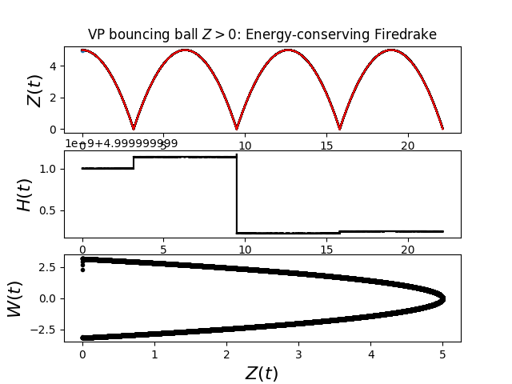

# Onno's sketchpad
02-04-2025: BB code acwaveEcollballnft2026aa.py

Try $a=10$ but still $b =10{\Delta t}^{3/2}$ for $\lambda = -a e^{-\gamma Z /b}$:

gam: 4.00, a: 10.00000, b: 0.02828, dt: 0.02000, Linferror: 0.55697, L2error: 0.44202

gam: 4.00, a: 10.00000, b: 0.01000, dt: 0.01000, Linferror: 0.26424, L2error: 0.21017

gam: 4.00, a: 10.00000, b: 0.00354, dt: 0.00500, Linferror: 0.12462, L2error: 0.09923

gam: 4.00, a: 10.00000, b: 0.00125, dt: 0.00250, Linferror: 0.05859, L2error: 0.04667

gam: 4.00, a: 10.00000, b: 0.00044, dt: 0.00125, Linferror: 0.02725, L2error: 0.02171

1st  0.44min; 2nd 1min; 3rd 1.75min; 4th 4min; 5th 7.34min; order is about $(\Delta t)^{1.1}$.

  

25-08-2025: see wave energy 2025 folder.
 

13-07: Typos corrected in pdf and updated code (...copy.py)

09-07-2025 update for Colin:
* two energy-conserving bouncing ball codes; one with Z fails since Z<0 in iterate I suspect; but I did not catch out Z^n+1=Z^n; but one with theta as in Z=exp(theta) seems to work. Terribly slow!
Note that in the graph above one can see in the middle eenrgy panel where Z~0 where L'Hopital is used; so some refinement seems needed.
* Notes updated; see red-colour and "Colin Cotter:" indicated parapragh starts!
* I have a Brown-MMP based Benney-Luke model; I will upload that one shortly and also work on energy-conserving code for that case but with lambda explicitly removed.

Billards codes:

...VI.py: file with VI without Lagrange multiplier (code runs but particle does not see wall).
Tried to follow drape.py (ball case) in: https://bitbucket.org/pefarrell/fascd/src/master/examples/drape.py

...VIlam.py: file with VI with Lagrange multiplier and all KKT-equations explicit (code runs but particle does not see wall).

....py: Burman solution with soft wall. Works when dt and softness are tuned such that "particle can turn around smoothly with resolved time stepping near the wall"

All plotting done via matplotlib on the fly.

See pdf.
